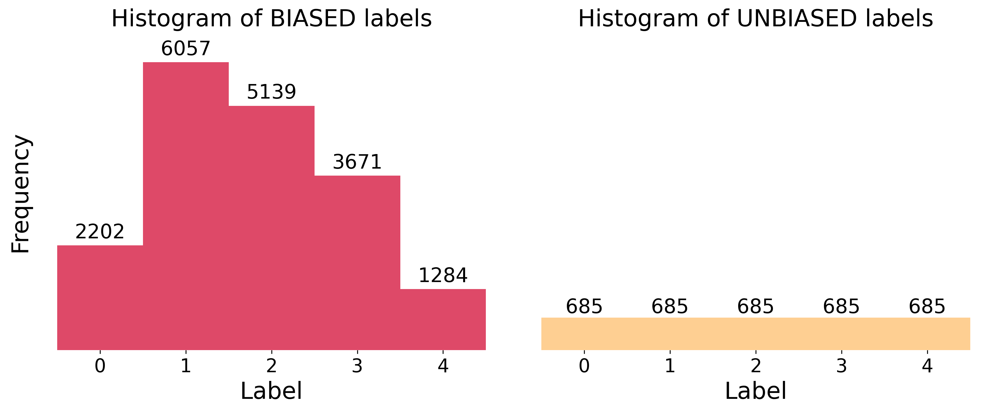
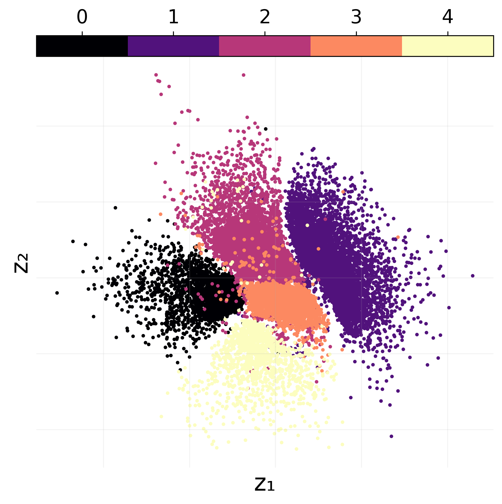
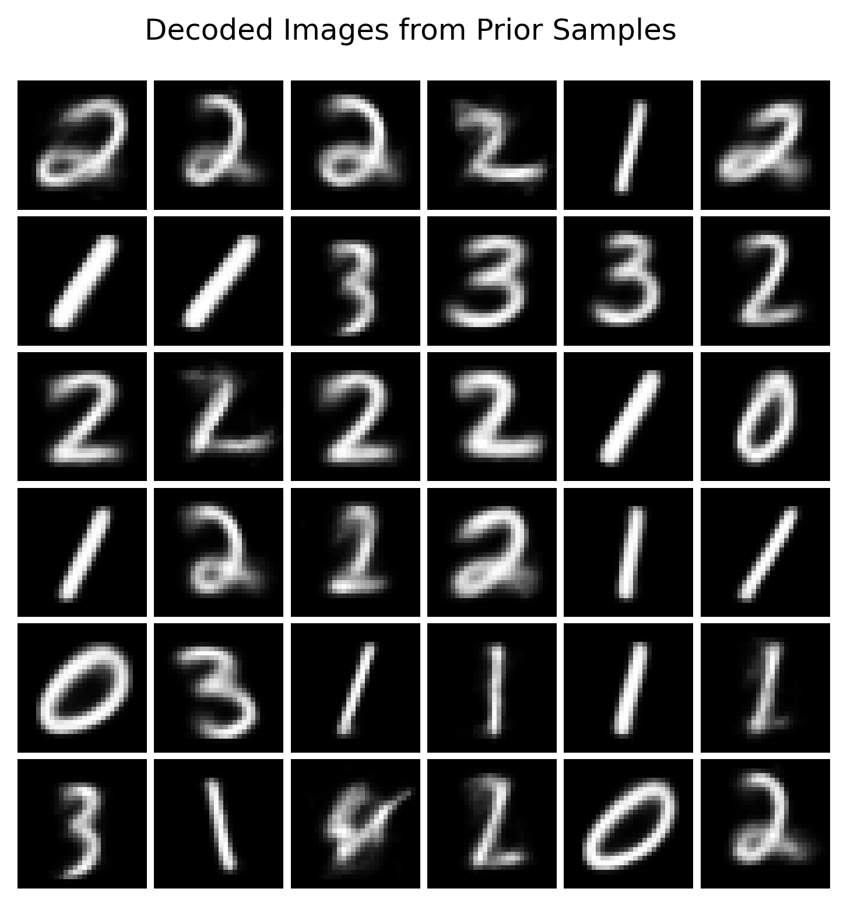
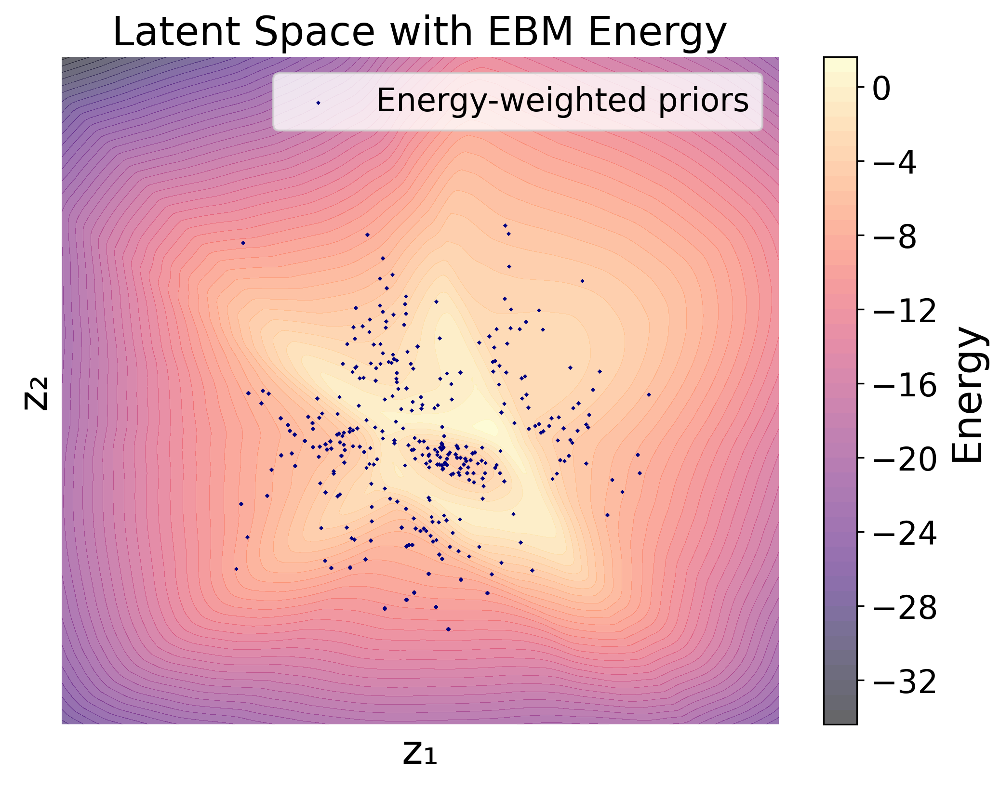
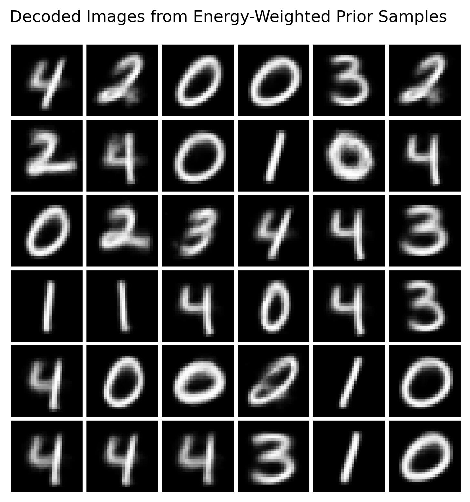
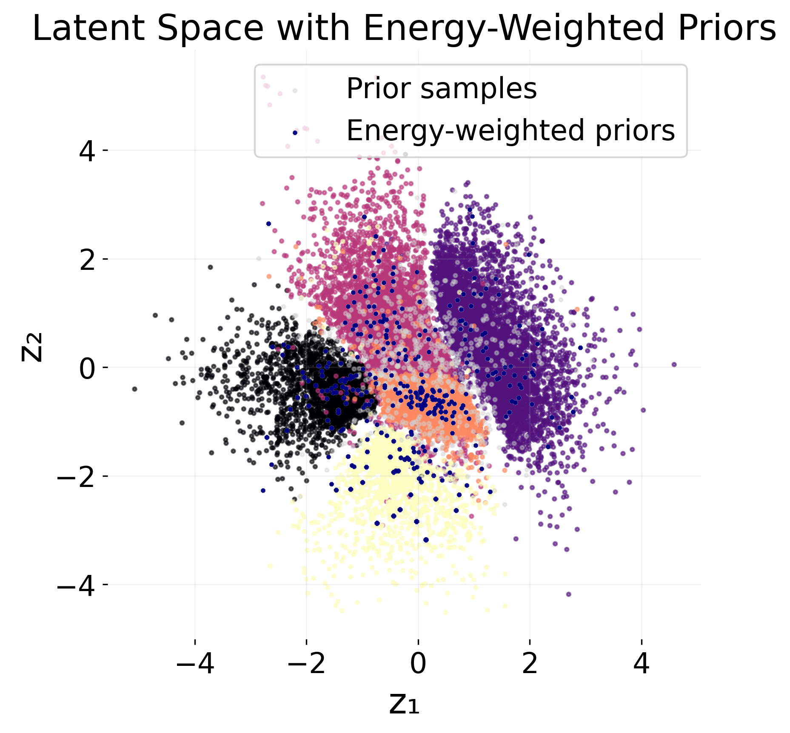

# HackathonEBM

  

In MIWAE_Pytorch_exercises_demo_ProbAI, a base model is implemented and trained on MNAR Data. We will modify this model with an Energy-Based Model (EBM) to handle the MNAR data more effectively.

  
  # Objective

## 1) Using a VAE in data space

### 1.1) Train a VAE on MNAR data

The first objective is to train a Variational Autoencoder (VAE) on MNAR data, and then extend it with an EBM.  

VAE:

```math
p_{\phi}(x) = \int p_{\phi}(x|z) \, p(z) \, dz
```

where:

```math
p_{\phi}(x|z) = \mathcal{N}(x; \mu_{\theta}(z), \sigma_{\theta}(z))
```

```math
p(z) = \mathcal{N}(z; 0, I)
```

with $\mu_{\theta}(z)$ and $\sigma_{\theta}(z)$ parameterized by neural networks.

As usual in the VAE setting, we use the **reparameterization trick** to sample from $p_{\phi}(x|z)$:

```math
x = \mu_{\theta}(z) + \sigma_{\theta}(z) \odot \epsilon, \quad \epsilon \sim \mathcal{N}(0, I)
```

We then obtain a lower bound on the likelihood (ELBO):

```math
L_{VAE} = \mathbb{E}_{p_{\phi}(x|z)} \left[ \log p_{\phi}(x|z) \right] 
- D_{KL}\!\left(q_{\phi}(z|x) \,\|\, p(z)\right)
```

where $q_{\phi}(z|x)$ is the encoder of the VAE, also parameterized with a neural network.


### 1.2) Tilting the VAE with an EBM

We extend the VAE by tilting its distribution with an EBM:

```math
p_{\theta}(x) = \frac{1}{Z_{\theta}} e^{-E_{\theta}(x)} p_{\phi}(x)
```

where $E_{\theta}(x)$ is the energy function (a neural network), and $Z_{\theta}$ is the partition function ensuring normalization.

The training objective becomes:

```math
L_{EBM} = \frac{1}{n}\sum_{i=1}^n \left[-E_{\theta}(x_i) + \log p_{\phi}(x_i)\right] 
+ \log \mathbb{E}_{p_{\phi}(\tilde{x})}\!\left[ e^{-E_{\theta}(\tilde{x})} \right]
```

Using Jensen's inequality, we obtain a lower bound:

```math
L_{EBM} \geq \frac{1}{n}\sum_{i=1}^n \left[-E_{\theta}(x_i) + \log p_{\phi}(x_i)\right] 
+ \mathbb{E}_{p_{\phi}(\tilde{x})} \left[ -E_{\theta}(\tilde{x}) \right]
```

The gradient with respect to $\theta$ is:

```math
\nabla_{\theta} L_{EBM} = \frac{1}{n}\sum_{i=1}^n \left( -\nabla_{\theta} E_{\theta}(x_i)\right) 
+ \mathbb{E}_{p_{\phi}(\tilde{x})}\!\left[ -\nabla_{\theta} E_{\theta}(\tilde{x}) \right]
```


### 1.3) Sampling with Importance Sampling

We can sample from the model using importance sampling, with the VAE as a proposal distribution $p_{\phi}(x)$:

```math
\tilde{w}_i = e^{-E_{\theta}(x_i)}, \quad x_i \sim p_{\phi}(x)
```

Since $Z_{\theta}$ is unknown, we use self-normalized importance sampling (SNIS):

```math
w_i = \frac{\tilde{w}_i}{\sum_{j=1}^n \tilde{w}_j}
```

We then resample $\tilde{x}_i$ according to $w_i$.


### 1.4) Sampling with MCMC

Alternatively, we can sample using an MCMC chain guided by the full log-likelihood gradient:

```math
\nabla_{x} \log p_{\theta}(x) = -\nabla_{x} E_{\theta}(x) + \nabla_{x} \log p_{\phi}(x)
```

where $p_{\phi}(x)$ can be approximated via the ELBO of the VAE.

The MCMC update rule is:

```math
x_{t+1} = x_t - \eta \left( -\nabla_{x} E_{\theta}(x_t) + \nabla_{x} \log p_{\phi}(x_t) \right)
```

where $\eta$ is the step size.

---

## 2) Using a VAE in latent space

### 2.1) Train the VAE

Same as before.

### 2.2) Tilt the prior with an EBM

We can tilt the latent prior instead of the data distribution:

```math
p_{\theta}(x) = \int_{z} \frac{1}{Z_{\theta}} e^{-E_{\theta}(z)} p_{\phi}(x|z) p(z) \, dz
```

The tilted prior becomes:

```math
p_{\theta}(z) = \frac{e^{-E_{\theta}(z)} p(z)}{Z_{\theta}}
```

Training objective:

```math
\mathcal{L}_{EBM} 
= \log \mathbb{E}_{q_{\psi}(z|x)}\!\left[\frac{1}{Z_{\theta}}  
\frac{e^{-E_{\theta}(z)} p_{\phi}(x|z) p(z)}{q_{\psi}(z|x)}\right]
```

Applying Jensen’s inequality:

```math
\mathcal{L}_{EBM} \leq 
\mathbb{E}_{q_{\psi}(z|x)}\!\left[-E_{\theta}(z) + \log p(z) - \log q_{\psi}(z|x) + \log p_{\phi}(x|z)\right] 
- \log Z_{\theta}
```

Partition function:

```math
\log Z_{\theta} = \log \mathbb{E}_{p(z)}\!\left[ e^{-E_{\theta}(z)} \right]
```

Final form:

```math
\mathcal{L}_{EBM} =  
\mathbb{E}_{q_{\psi}(z|x)}\!\left[-E_{\theta}(z)\right] 
- \mathbb{E}_{p(\tilde{z})}\!\left[-E_{\theta}(\tilde{z})\right] + \ldots
```


### 2.3) Sampling

- Self-normalized importance sampling with $p(z)$ as proposal  
- Alternatively, sampling with MCMC


## 3) Takeaways

Results with the EBM in data space have been unconvincing so far, better results in the latent space (see 2d-small.ipynb). The notebook is extended into 2d.ipynb, which contains additional results measuring the degree of debiasing as well as a more advanced sampling method (Langevin MCMC). Lower dimensional latent spaces appear to be more easy to work with than higher dimensional ones (see 10d-small.ipynb).

## Short walkthrough of the 2D latent EBM
We first compare the label distributions of biased and unbiased datasets to illustrate a setting of class imbalance between training and test scenarios.  


Next, we train and encode the biased data onto the 2D latent space to observe how digit classes separate under the trained VAE.


We then sample from the standard normal prior and decode those latent vectors to inspect the raw generative quality based on prior-sampled images.


Next, we fit the EBM and contour the learned EBM energy landscape over the latent plane. Using the EBM, we can adjust prior samples to have a better fit to the (limited) unbiased data.



Decoding the energy-weighted samples, we can see that the model manages to sample more images from the undersampled classes.


We overlay the original latent embeddings with both unweighted and energy-weighted prior samples to visualize how the EBM can help adjust class imbalance for generative models!  


Notebook 2d.ipynb contains additional results.


